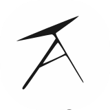

# Artsy

 

Este é o repositório da plataforma para ilustradores e artistas em geral Artsy. O Website foi desenvolvido durante o TCC do terceiro ano de desenvolvimento de sistemas em 2021, na ETEC Professor Camargo Aranha.

## Stack

- Next.JS + Typescript
- Styled-Components
- Mikro-ORM
- Wizer

## Criadores

- Gabriel Araújo de Jesus
- Gabriel Takuya Yamamoto
- Paulo Henrique de Souza
- Davi Ganilho Lima
- Heitor Hiroyuki Shirai

## Links

- [Site](https://tcc-artsy.herokuapp.com/) (Host: Heroku)
- [Figma](https://www.figma.com/file/1SMYnxBllqx2YhKfIelFXg/Artsy)
- [Documentação](https://www.figma.com/file/1SMYnxBllqx2YhKfIelFXg/Artsy) ( Inclui o Wizer, projeto conjunto )
